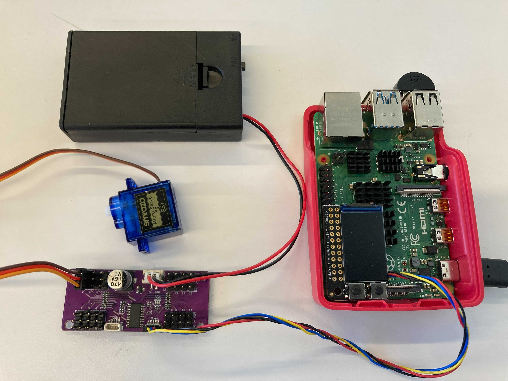

# Ph-UI!!!


**COLLABORATORS:**

**Shai Aarons (sla88)**

**Ariana Bhigroog (ab2959)**

**Jon Caceres (jc3569)**

**Rachel Minkowitz (rhm256)**

**Amando Xu (ax45)**


For lab this week, we focus both on sensing, to bring in new modes of input into your devices, as well as prototyping the physical look and feel of the device. You will think about the physical form the device needs to perform the sensing as well as present the display or feedback about what was sensed. 

## Part 1 Lab Preparation

### Start brainstorming ideas by reading: 
* [What do prototypes prototype?](https://www.semanticscholar.org/paper/What-do-Prototypes-Prototype-Houde-Hill/30bc6125fab9d9b2d5854223aeea7900a218f149)
* [Paper prototyping](https://www.uxpin.com/studio/blog/paper-prototyping-the-practical-beginners-guide/) is used by UX designers to quickly develop interface ideas and run them by people before any programming occurs. 
* [Cardboard prototypes](https://www.youtube.com/watch?v=k_9Q-KDSb9o) help interactive product designers to work through additional issues, like how big something should be, how it could be carried, where it would sit. 
* [Tips to Cut, Fold, Mold and Papier-Mache Cardboard](https://makezine.com/2016/04/21/working-with-cardboard-tips-cut-fold-mold-papier-mache/) from Make Magazine.
* [Surprisingly complicated forms](https://www.pinterest.com/pin/50032245843343100/) can be built with paper, cardstock or cardboard.  The most advanced and challenging prototypes to prototype with paper are [cardboard mechanisms](https://www.pinterest.com/helgangchin/paper-mechanisms/) which move and change. 
* [Dyson Vacuum Cardboard Prototypes](http://media.dyson.com/downloads/JDF/JDF_Prim_poster05.pdf)
<p align="center"> </p>

### Gathering materials for this lab:

* Cardboard (start collecting those shipping boxes!)
* Found objects and materials--like bananas and twigs.
* Cutting board
* Cutting tools
* Markers
* New hardware for your kit will be handed out. Update your parts list. 

(We do offer shared cutting board, cutting tools, and markers on the class cart during the lab, so do not worry if you don't have them!)

## Deliverables & Submission for Lab 4

The deliverables for this lab are, writings, sketches, photos, and videos that show what your prototype:
* "Looks like": shows how the device should look, feel, sit, weigh, etc.
* "Works like": shows what the device can do.
* "Acts like": shows how a person would interact with the device.

For submission, the readme.md page for this lab should be edited to include the work you have done:
* Upload any materials that explain what you did, into your lab 4 repository, and link them in your lab 4 readme.md.
* Link your Lab 4 readme.md in your main Interactive-Lab-Hub readme.md. 
* Group members can turn in one repository, but make sure your Hub readme.md links to the shared repository.
* Labs are due on Mondays, make sure to submit your Lab 4 readme.md to Canvas.


## Lab Overview

A) [Capacitive Sensing](#part-a)

B) [OLED screen](#part-b) 

C) [Paper Display](#part-c)

D) [Materiality](#part-d)

E) [Servo Control](#part-e)

F) [Camera Test](#part-f)

G) [Record the interaction](#part-g)

## The Report (Part 1: A-D, Part 2: E-F)

### Part A
### Capacitive Sensing, a.k.a. Human-Twizzler Interaction 

We want to introduce you to the [capacitive sensor](https://learn.adafruit.com/adafruit-mpr121-gator) in your kit. It's one of the most flexible input devices we are able to provide. At boot, it measures the capacitance on each of the 12 contacts. Whenever that capacitance changes, it considers it a user touch. You can attach any conductive material. In your kit, you have copper tape that will work well, but don't limit yourself! In the example below, we use Twizzlers--you should pick your own objects.


<p float="left">

</p>

Plug in the capacitive sensor board with the QWIIC connector. Connect your Twizzlers with either the copper tape or the alligator clips (the clips work better). Install the latest requirements from your working virtual environment:

```
(circuitpython) pi@ixe00:~/Interactive-Lab-Hub/Lab 4 $ pip install -r requirements.txt
```


These Twizzlers are connected to pads 6 and 10. When you run the code and touch a Twizzler, the terminal will print out the following

```
(circuitpython) pi@ixe00:~/Interactive-Lab-Hub/Lab 4 $ python cap_test.py 
Twizzler 10 touched!
Twizzler 6 touched!
```

### Part B
### More sensors

#### Light/Proximity/Gesture sensor (APDS-9960)

We here want you to get to know this awesome sensor [Adafruit APDS-9960](https://www.adafruit.com/product/3595). It is capable of sensing proximity, light (also RGB), and gesture! 


Connect it to your pi with Qwiic connector and try running the three example scripts individually to see what the sensor is capable of doing!

```
(circuitpython) pi@ixe00:~/Interactive-Lab-Hub/Lab 4 $ python proximity_test.py
...
(circuitpython) pi@ixe00:~/Interactive-Lab-Hub/Lab 4 $ python gesture_test.py
...
(circuitpython) pi@ixe00:~/Interactive-Lab-Hub/Lab 4 $ python color_test.py
...
```

You can go the the [Adafruit GitHub Page](https://github.com/adafruit/Adafruit_CircuitPython_APDS9960) to see more examples for this sensor!

#### Rotary Encoder (optional)

> **_NOTE:_**  Not in the kit yet - skip this.

A rotary encoder is an electro-mechanical device that converts the angular position to analog or digital output signals. The [Adafruit rotary encoder](https://www.adafruit.com/product/4991#technical-details) we ordered for you came with separate breakout board and encoder itself, that is, they will need to be soldered if you have not yet done so! We will be bringing the soldering station to the lab class for you to use, also, you can go to the MakerLAB to do the soldering off-class. Here is some [guidance on soldering](https://learn.adafruit.com/adafruit-guide-excellent-soldering/preparation) from Adafruit. When you first solder, get someone who has done it before (ideally in the MakerLAB environment). It is a good idea to review this material beforehand so you know what to look at.

<p float="left">


</p>

Connect it to your pi with Qwiic connector and try running the example script, it comes with an additional button which might be useful for your design!

```
(circuitpython) pi@ixe00:~/Interactive-Lab-Hub/Lab 4 $ python encoder_test.py
```

You can go to the [Adafruit Learn Page](https://learn.adafruit.com/adafruit-i2c-qt-rotary-encoder/python-circuitpython) to learn more about the sensor! The sensor actually comes with an LED (neo pixel): Can you try lighting it up? 

#### Joystick (optional)

A [joystick](https://www.sparkfun.com/products/15168) can be used to sense and report the input of the stick for it pivoting angle or direction. It also comes with a button input!

<p float="left">

</p>

Connect it to your pi with Qwiic connector and try running the example script to see what it can do!

```
(circuitpython) pi@ixe00:~/Interactive-Lab-Hub/Lab 4 $ python joystick_test.py
```

You can go to the [SparkFun GitHub Page](https://github.com/sparkfun/Qwiic_Joystick_Py) to learn more about the sensor!

#### Distance Sensor

Earlier we have asked you to play with the proximity sensor, which is able to sense objects within a short distance. Here, we offer [Sparkfun Proximity Sensor Breakout](https://www.sparkfun.com/products/15177), With the ability to detect objects up to 20cm away.

<p float="left">

</p>

Connect it to your pi with Qwiic connector and try running the example script to see how it works!

```
(circuitpython) pi@ixe00:~/Interactive-Lab-Hub/Lab 4 $ python qwiic_distance.py
```

You can go to the [SparkFun GitHub Page](https://github.com/sparkfun/Qwiic_Proximity_Py) to learn more about the sensor and see other examples!

### Part C
### Physical considerations for sensing

Usually, sensors need to be positioned in specific locations or orientations to make them useful for their application. Now that you've tried a bunch of the sensors, pick one that you would like to use, and an application where you use the output of that sensor for an interaction. For example, you can use a distance sensor to measure someone's height if you position it overhead and get them to stand under it.
***
**5 sketches of different ways you might use your sensor, and how the larger device needs to be shaped in order to make the sensor useful.**


***
**What are some things these sketches raise as questions? What do you need to physically prototype to understand how to answer those questions?***

There were a few sensors we wanted to consider for this lab. 

Our *favorite* sensors from the ones provided were: 

a) Camera 

b) Mic 

c) Buttons 

d) Distance Sensor

The possibilities of interactive devices using these sensors was a bit overwhelming, so we decided to take inspiration from popular culture (because that was bound to limit our scope). While brainstorming, we mocked up a couple of these sketches and reviewed the pros and cons of each device before continuing. An important consideration we wanted to keep in mind was the physical interaction that we needed to have with the device, in order for the sensor to sense the user's 'input'. 

**From each sketch, here are some questions that arose:**

Bender Security:
1. What is the maximum distance the distance sensor can detect?

Bender Toilet:
1. How does the sensor detect the position of the toilet lid?

Wizarding Hat:
1. How does the light sensor differentiate between someone wearing the hat and other environmental changes?

Scooby-Snacks: Sandwich Selector: 
1. How does the joystick interface with the selection process?
2. What happens once a sandwich is selected? Is it just an order or is there an actual physical sandwich-making component involved?

Bruno Bowl:
1. How does the bowl ensure it doesn’t overfill, especially if there's a malfunction?


***
**To physically prototype and answer most of these question, here is what we would need to understand:**

Bender Security: Test the logic that will control Bender Security's laser activation and table rotation based on the distance sensor's feedback. 

Bender Toilet: Test the lid sensor and feedback mechanism, we would need users to interact with the Bender Toilet to see if the functinality is intuitive and effective.

Wizarding Hat:Test the light sensor's sensitivity and differentiate its response based on external triggers.

Sandwich Selector: Test a functional joystick and feedback mechanism that would be useful to understand the user experience.

Bruno Bowl: Test spout and sensor interaction through a functioning spout mechanism integrated with a sensor.

***
**Pick one of these designs to prototype.**


Video:<br>
[](http://www.youtube.com/watch?v=hRy3MPdV0WE)


After brainstorming several designs we decided to go with a home security concept using Bender's head - called `Security Bender`. The premise of our idea is based off of the beloved character - 'Bender' from Futurama. Bender is known to have many vices, one which is stealing. Since Bender loves stealing, we thought it would be ironic to create a 'Security Bender' which is activated through distance, sound and camera. While in Patrol mode, if someone passes Security Bender, he *activates* and acts as a warning for the person who isn't supposed to be there i.e. presumably stealing something. We wanted to create Security Bender as it incorporates a few sensors and adults want this as a cool toy and to keep them "safe" :)


### Part D
### Physical considerations for displaying information and housing parts

Think about how you want to present the information about what your sensor is sensing! Design a paper display for your project that communicates the state of the Pi and a sensor. Ideally you should design it so that you can slide the Pi out to work on the circuit or programming, and then slide it back in and reattach a few wires to be back in operation.

***
**Sketch 5 designs for how you would physically position your display and any buttons or knobs needed to interact with it.**

<br>

<br>

<br>

<br>


***
**What are some things these sketches raise as questions? What do you need to physically prototype to understand how to anwer those questions?**

These sketches raised concerns about how to possibly 3D print this device for our actual implementation in the second part of the lab. We designed a 3D version equivalent and realized we had to scale down our model to have this built in a realistic timeframe. We had to place certain sensors that we planned to use in different places to see which made the most sense. For our final physical prototype, we have to create a frame that would be the same size as the raspberry pi and the various sensors to decide where the parts most logically make sense to placed physically. Here are some further questions that were raised:

1) How are the various components (camera, microphone, distance sensor, OLED screen) powered and connected within the Bender head? - We decided that we would need to create a hollow head shell so that we could feed wires inside to the various parts.
2) Are all components integrated into a single board, or are they separate modules? We decided that for this to work best, we would need to have separate modules
3) Is there any feedback mechanism (e.g., audio or visual cues) to indicate the device’s status or any detected intrusions? We decided that we would need to use buttons to turn off the alarm
4) We asked how far the distance sensor would reach. We realized that the distance sensor does not detect far away movements, hence we included the camera as an additional sensor
5) Due to the fact that we would like the Bender head to rotate on a small plate, we have concerns about the weight of the device. During prototyping, we, again, realized that we would require a hollow shell for the head to reduce the weight.
6) We realized in the sketches and prototyping that the device would have a blind spot behind the head. Because of this, we have decided to potentially use the microphone as an additional sensor to detect noises 

***
**Rationale for the design.** 
Bender has several features that we thought would go well with home security. It has two eyes which could be used as sensors to detect motion (although we will be using a camera and inserting it into his mouth for this purpose). We will be using laser diodes that will be inserted into his eyes and will emit a laser when motion is detected. We will also use the speaker for Bender to alert the user when he's detected them.

Bender will have 3 modes: standby mode, patrol mode, and alarm mode.

**Standby**
In Standby Mode, Bender will not be actively patrolling and will be essentially 'off', however he can still be controlled and turned on via the display + controls

**Patrol**
In Patrol Mode, Bender will be constantly and slowly rotating 360 degrees on a platform (powered by a servo). It will be using the camera, microphone, and distance sensor to be sensing the presence of someone in the room. Upon detection it will stop rotating and transition into Alarm Mode.

**Alarm**
In Alarm Mode, lasers will be flashing from Bender's eyes and he will be speaking to the user as well. Noises and other sounds may also be playing.

***
**Prototype**


Our cardboard prototype proved helpful to discuss where each sensor would be placed. 
- We wanted to camera to be inconspicuous and therefore was places inside Bender's mouth - where a space was cut out precisely for this purpose. 
- The Distance sensor will be on Bender's forehead as it needs to be able to sense any passing movement and cannot be obstructed
- Laser beam lights will turn on from Bender's eyes to lend to the feel of Bender being on the lookout
- We decided to strategically place the display screen on the back of Bender's head as we hope Bender will be rotating on a 360 degree turntable of sorts and was crowding on the front of his face. 
- The button/joystick next to the display is for setting/resetting the various modes (patrol, standby, alarm) and it seemed logical to place it next to the display screen as this button cotrols what it being seen on the screen. 


***
**Process**


### Part 2

Following exploration and reflection from Part 1, complete the "looks like," "works like" and "acts like" prototypes for your design, reiterated below.

### Part E (Optional)
### Servo Control with Joystick
> **_NOTE:_**  Not in the kit yet.

In the class kit, you should be able to find the [Qwiic Servo Controller](https://www.sparkfun.com/products/16773) and [Micro Servo Motor SG51](https://www.adafruit.com/product/2201). The Qwiic Servo Controller will need external power supply to drive, which is included in your kit. Connect the servo controller to the miniPiTFT through qwiic connector and connect the external battery to the 2-Pin JST port (ower port) on the servo controller. Connect your servo to channel 2 on the controller, make sure the brown is connected to GND and orange is connected to PWM.



In this exercise, we will be using the nice [ServoKit library](https://learn.adafruit.com/16-channel-pwm-servo-driver/python-circuitpython) developed by Adafruit! We will continue to use the `circuitpython` virtual environment we created. Activate the virtual environment and make sure to install the latest required libraries by running:

```
(circuitpython) pi@ixe00:~/Interactive-Lab-Hub/Lab 4 $ pip3 install -r requirements.txt
```

A servo motor is a rotary actuator or linear actuator that allows for precise control of angular or linear position. The position of a servo motor is set by the width of an electrical pulse, that is, we can use PWM (pulse-width modulation) to set and control the servo motor position. You can read [this](https://learn.adafruit.com/adafruit-arduino-lesson-14-servo-motors/servo-motors) to learn a bit more about how exactly a servo motor works.

Now that you have a basic idea of what a servo motor is, look into the script `servo_test.py` we provide. In line 14, you should see that we have set up the min_pulse and max_pulse corresponding to the servo turning 0 - 180 degrees. Try running the servo example code now and see what happens:

```
(circuitpython) pi@ixe00:~/Interactive-Lab-Hub/Lab 4 $ python servo_test.py
```

It is also possible to control the servo using the sensors mentioned in as in part A and part B, and/or from some of the buttons or parts included in your kit, the simplest way might be to chain Qwiic buttons to the other end of the Qwiic OLED. Like this:

<p align="center"> </p>

You can then call whichever control you like rather than setting a fixed value for the servo. For more information on controlling Qwiic devices, Sparkfun has several python examples, such as [this](https://learn.sparkfun.com/tutorials/qwiic-joystick-hookup-guide/all#python-examples).

We encourage you to try using these controls, **while** paying particular attention to how the interaction changes depending on the position of the controls. For example, if you have your servo rotating a screen (or a piece of cardboard) from one position to another, what changes about the interaction if the control is on the same side of the screen, or the opposite side of the screen? Trying and retrying different configurations generally helps reveal what a design choice changes about the interaction -- _make sure to document what you tried_!

### Part F (Optional)
### Camera
You can use the inputs and outputs from the video camera in the kit. 
We provide another script called camera_test.py to test the USB camera on raspberry pi. 
It uses qt to render a video to the screen, so it is necessary to connect a screen or to connect via VNC to run this script. 

First install some more dependencies into your virtual environment. OpenCV should already be installed on the Pi for the super user. 

```
sudo apt-get install portaudio19-dev python-all-dev
pip install opencv-python pyaudio pygame
```

Once executed the script will render the camera output, press 'q' to stop video and record a sound through the microphone which will be played back by specificing the audio output. 

---
The video is rendered locally on the pi. For wizarding interactions and prototyping it can be necessary to stream the video to another device such as your laptop. A wizard, observing the user and acting as a computer vision algorithm, can then trigger interactions remotley, such as we did in the tinkerbelle lab.

The following resources are good starts on how to stream video: 
* [OpenCV – Stream video to web browser/HTML page](https://pyimagesearch.com/2019/09/02/opencv-stream-video-to-web-browser-html-page/)
* [Live video streaming over network with OpenCV and ImageZMQ](https://pyimagesearch.com/2019/04/15/live-video-streaming-over-network-with-opencv-and-imagezmq/)
### Part G
### Record

[VIDEO OF PROCESS AND DEMO](https://drive.google.com/file/d/1SH8n51JZRg1f9AlG9LcrBl-lvNz1HhX7/view?usp=sharing)

Bender Security is a unique and playful security device designed to protect your space. Combining elements of science fiction and modern technology, this 3D printed Bender head is a multi-functional guardian that "Looks like" an inconspicuos robotic character, "Works like" a security robot, and "Acts like" an interactive motion (?human?) detection security system.

**1. Looks Like**


*Appearance:* Bender Security features a custom 3D printed Bender head with attention to detail, capturing the iconic look of the character from the animated series "Futurama." It stands approximately 25 cm tall, and the Bender head rests on a wooden base designed for rotation.

*Materials:* The external Bender head is crafted from high-quality, durable 3D printed materials, which makes the device lightweight yet robust, ensuring longevity and an authentic robot representation of the character. Some other materials used for assembly include wooden dowels, velcro, hot glue, wooden base and tissues (?)  

*Color Scheme:* The Bender head retains the character's metallic gray color with black accents and shiny white teeth. After the Bender head was sanded down to remove any residual 3D printing imperfections, this color was accomplished using spray paint and spray painting skills. 

*Weight and Dimensions:* The entirety of the device (including the raspeberry pi and camera) weighs about 2 pounds and measures 24.765cm in height, 6.5cm in width, and 6cm in length. We wanted Bender Security to be small enough to be propped on a desktop without taking up too much space and be light enough that it's portable and can be easily brought to a location that you want to monitor at the moment. 


**2. Works Like**

*Motion Detection:* Bender Security rotates 360 degrees while monitoring motion at all times. The completed code for Bender Security can be found in the `bender_home_security/` folder. This folder includes the code for the various sensor components that we have incorporated. These sensors all act together to work like an effective security measure by sensing movement and sending a warning/scaring away the intruder.
- Camera: Located within Bender's mouth, a discreet camera serves as the primary means of identifying motion. The camera has a wide-angle view, allowing it to capture a broad area and 'sends a message' to the lasers and servo propeller to activate "Alert mode" once it senses an intruder. The code for motion detection is in `motion_detection.py`, this code uses `darknet` and `YoloV4` python libraries to detect humans specifically. Once the people are detected, the servo motor stops. We did notice a lag in what the camera was seeing and it's processing time - which effected Bender's response to the human. We looked into reducing the frame rate but actually reducing the resolution and 'Optimizing the Yolo input' fixed the issue. There is still a minor lag between when Bender sees someone until he goes into 'Alert mode'. 
- Servo Rotation: By default, the Bender Security rotates 360 degrees continuously when not in "Alert mode." When Bender Security goes into "Alarm mode" (senses an intruder) the servo motor stops its rotation. This not only makes it an amusing conversation piece but also provides an unobstructed view of its surroundings. There were a couple of considerations we made when setting up the servo motor, one being speed and rotation angle. If the speed was too fast, the wire would wrap around the motor and would force the propeller off the base. Additionally if the servo continuosly rotates at 360 degrees, the wire would wrap around the base too many times and tangle. 
- Lasers: When motion is detected, aside from halting rotation, Bender security's eyes light up with laser-like beams, creating an intimidating presence. These lasers are controlled with code in the `laser.py` file. We make sure that both the lasers turn on at the same time. Thank you Shai for insisting on lasers in this project.
- Audio Playback: Bender Security is equipped with a speaker on the camera that can produce sound effects and voice lines from the "Futurama" series. When in Alarm mode, Bender Security says the infamous line, "Kill all humans," adding an element of humor to its security role. The edits for the audio can be found in `security.py`. One major consideration that was made is the level of the volume. At first, the sound was too low and could not be heard but after changing some of the code, Bender's exclamation was heard loud and clear through Bender's head. 

What would be cool eventually:
Imagine a world where we could have *Remote Access* to Bender Security. The device would be connected to a mobile app, allowing users to remotely control its movements, lighting, and sound effects, providing additional safety, flexibility and functionality while people are not near Bender Security.


**3. Acts Like**

*Interaction:* Interacting with the Bender Security Bender is intended to be frightning but in fact is both fun and engaging. Users can activate its rotation, laser and sound features by just moving in front of the camera that's expertly positioned inside Bender's mouth. 

*Customizable Responses:* Bender Security can actually be programmed to deliver different lines from the "Futurama" series, making it a versatile and humorous companion in various social settings.

*Security Response:* When the device senses motion, it responds by stopping its rotation, lighting up its laser eyes, and delivering the iconic "Kill all humans" line. This response is designed to deter potential intruders.

Video of interaction only: https://github.com/ironclock/Interactive-Lab-Hub/assets/70418227/e6bae1a1-4881-43de-b010-b3b5a9bbe373


***
**Reflection**
This lab proved to be a journey. At first we started off wanting to incorporate everything that we discussed in Part A, but as time went on we scaled our idea down - enough that it was still super cool, but doable. To start, Jon began 3D printing Bender's head in the beginning of the week. Looking back, coding the different sensors to interact with each other was easy in comparison to the physical assembly. The hardest part of this lab was incorporating all the hardware components into Bender's head harmoniously. We did not expect all the physical components to be so big or 'wirey' and things may have 'looked better in theory'. We started with making sure that the camera was suspended inside Bender's head so that the camera was viewing the world without being obstructed by Bender's mouth. This proved to be challenging, but with some dowel action and extra strength velcro, camera was situated correctly. Incorporating the lasers was also complicated as they had more wiring than anticipated. We initially thought that the pi would be situated inside Bender's head - thereby being concealed, but due to limited space, we opted to leave the pi outside. This ended up working in our favor as we had the video streamed to the pi display and we could test the camera through that. The last thing that was complicated to assemble was the servo motor and base wooden board. Since the motor is a tad off center from the pack it was essential to balance Bender's head with all its components on the board while ensuring that when the board rotates, Bender's head is significantly balanced and would not tip over. With the help of hot glue and tape, Bender's head is secure on the platform and will hopefully stand the test of time. 

***
**Process:**

[VIDEO OF PROCESS & DEMO](https://drive.google.com/file/d/1SH8n51JZRg1f9AlG9LcrBl-lvNz1HhX7/view?usp=sharing)

| | | |
|:-------------------------:|:-------------------------:|:-------------------------:|
| |||
|  |  ||
| |||
| |||
| |||
| |||
|  |  ||
|  |  

