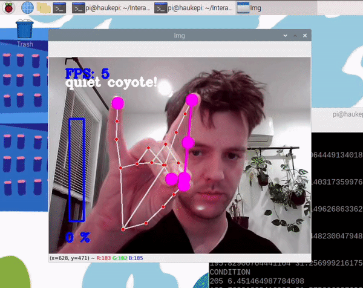
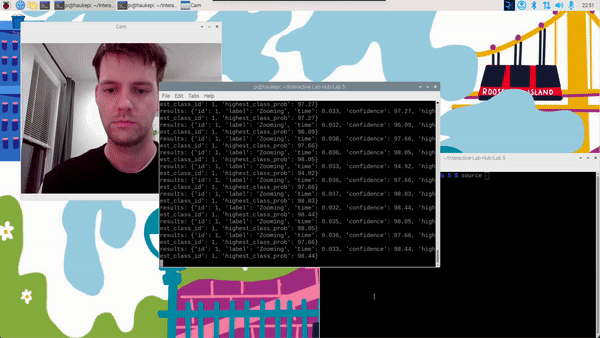

# Observant Systems

**Shai Aarons (sla88), Ariana Bhigroog (ab2959), Jon Caceres (jc3569), Rachel Minkowitz (rhm256), Amando Xu (ax45)**


For lab this week, we focus on creating interactive systems that can detect and respond to events or stimuli in the environment of the Pi, like the Boat Detector we mentioned in lecture. 
Your **observant device** could, for example, count items, find objects, recognize an event or continuously monitor a room.

This lab will help you think through the design of observant systems, particularly corner cases that the algorithms need to be aware of.

## Prep

1.  Install VNC on your laptop if you have not yet done so. This lab will actually require you to run script on your Pi through VNC so that you can see the video stream. Please refer to the [prep for Lab 2](https://github.com/FAR-Lab/Interactive-Lab-Hub/blob/-/Lab%202/prep.md#using-vnc-to-see-your-pi-desktop).
2.  Install the dependencies as described in the [prep document](prep.md). 
3.  Read about [OpenCV](https://opencv.org/about/),[Pytorch](https://pytorch.org/), [MediaPipe](https://mediapipe.dev/), and [TeachableMachines](https://teachablemachine.withgoogle.com/).
4.  Read Belloti, et al.'s [Making Sense of Sensing Systems: Five Questions for Designers and Researchers](https://www.cc.gatech.edu/~keith/pubs/chi2002-sensing.pdf).

### For the lab, you will need:
1. Pull the new Github Repo
1. Raspberry Pi
1. Webcam 

### Deliverables for this lab are:
1. Show pictures, videos of the "sense-making" algorithms you tried.
1. Show a video of how you embed one of these algorithms into your observant system.
1. Test, characterize your interactive device. Show faults in the detection and how the system handled it.

## Overview
Building upon the paper-airplane metaphor (we're understanding the material of machine learning for design), here are the four sections of the lab activity:

A) [Play](#part-a)

B) [Fold](#part-b)

C) [Flight test](#part-c)

D) [Reflect](#part-d)

---

### Part A
### Play with different sense-making algorithms.

#### Pytorch for object recognition

For this first demo, you will be using PyTorch and running a MobileNet v2 classification model in real time (30 fps+) on the CPU. We will be following steps adapted from [this tutorial](https://pytorch.org/tutorials/intermediate/realtime_rpi.html).


To get started, install dependencies into a virtual environment for this exercise as described in [prep.md](prep.md).

Make sure your webcam is connected.

You can check the installation by running:

```
python -c "import torch; print(torch.__version__)"
```

If everything is ok, you should be able to start doing object recognition. For this default example, we use [MobileNet_v2](https://arxiv.org/abs/1801.04381). This model is able to perform object recognition for 1000 object classes (check [classes.json](classes.json) to see which ones.

Start detection by running  

```
python infer.py
```

The first 2 inferences will be slower. Now, you can try placing several objects in front of the camera.

Read the `infer.py` script, and get familiar with the code. You can change the video resolution and frames per second (fps). You can also easily use the weights of other pre-trained models. You can see examples of other models [here](https://pytorch.org/tutorials/intermediate/realtime_rpi.html#model-choices). 


### Machine Vision With Other Tools
The following sections describe tools ([MediaPipe](#mediapipe) and [Teachable Machines](#teachable-machines)).

#### MediaPipe

A recent open source and efficient method of extracting information from video streams comes out of Google's [MediaPipe](https://mediapipe.dev/), which offers state of the art face, face mesh, hand pose, and body pose detection.



To get started, install dependencies into a virtual environment for this exercise as described in [prep.md](prep.md):

Each of the installs will take a while, please be patient. After successfully installing mediapipe, connect your webcam to your Pi and use **VNC to access to your Pi**, open the terminal, and go to Lab 5 folder and run the hand pose detection script we provide:
(***it will not work if you use ssh from your laptop***)


```
(venv-ml) pi@ixe00:~ $ cd Interactive-Lab-Hub/Lab\ 5
(venv-ml) pi@ixe00:~ Interactive-Lab-Hub/Lab 5 $ python hand_pose.py
```

Try the two main features of this script: 1) pinching for percentage control, and 2) "[Quiet Coyote](https://www.youtube.com/watch?v=qsKlNVpY7zg)" for instant percentage setting. Notice how this example uses hardcoded positions and relates those positions with a desired set of events, in `hand_pose.py`. 

Consider how you might use this position based approach to create an interaction, and write how you might use it on either face, hand or body pose tracking.

(You might also consider how this notion of percentage control with hand tracking might be used in some of the physical UI you may have experimented with in the last lab, for instance in controlling a servo or rotary encoder.)


#### Teachable Machines
Google's [TeachableMachines](https://teachablemachine.withgoogle.com/train) is very useful for prototyping with the capabilities of machine learning. We are using [a python package](https://github.com/MeqdadDev/teachable-machine-lite) with tensorflow lite to simplify the deployment process.



To get started, install dependencies into a virtual environment for this exercise as described in [prep.md](prep.md):

After installation, connect your webcam to your Pi and use **VNC to access to your Pi**, open the terminal, and go to Lab 5 folder and run the example script:
(***it will not work if you use ssh from your laptop***)


```
(venv-tml) pi@ixe00:~ Interactive-Lab-Hub/Lab 5 $ python tml_example.py
```


Next train your own model. Visit [TeachableMachines](https://teachablemachine.withgoogle.com/train), select Image Project and Standard model. The raspberry pi 4 is capable to run not just the low resource models. Second, use the webcam on your computer to train a model. *Note: It might be advisable to use the pi webcam in a similar setting you want to deploy it to improve performance.*  For each class try to have over 150 samples, and consider adding a background or default class where you have nothing in view so the model is trained to know that this is the background. Then create classes based on what you want the model to classify. Lastly, preview and iterate. Finally export your model as a 'Tensorflow lite' model. You will find an '.tflite' file and a 'labels.txt' file. Upload these to your pi (through one of the many ways such as [scp](https://www.raspberrypi.com/documentation/computers/remote-access.html#using-secure-copy), sftp, [vnc](https://help.realvnc.com/hc/en-us/articles/360002249917-VNC-Connect-and-Raspberry-Pi#transferring-files-to-and-from-your-raspberry-pi-0-6), or a connected visual studio code remote explorer).


Include screenshots of your use of Teachable Machines, and write how you might use this to create your own classifier. Include what different affordances this method brings, compared to the OpenCV or MediaPipe options.

#### (Optional) Legacy audio and computer vision observation approaches
In an earlier version of this class students experimented with observing through audio cues. Find the material here:
[Audio_optional/audio.md](Audio_optional/audio.md). 
Teachable machines provides an audio classifier too. If you want to use audio classification this is our suggested method. 

In an earlier version of this class students experimented with foundational computer vision techniques such as face and flow detection. Techniques like these can be sufficient, more performant, and allow non discrete classification. Find the material here:
[CV_optional/cv.md](CV_optional/cv.md).

### Part B
### Construct a simple interaction.

* Pick one of the models you have tried, and experiment with prototyping an interaction.
* This can be as simple as the boat detector showen in a previous lecture from Nikolas Matelaro.
* Try out different interaction outputs and inputs.

**Ideation**

1. E-cig/Vape recognizer - this model would recognize gestures that people who e-cig inconspicuously make
2. Calorie counter - this model would look at a food item and tell the user whether it's a healthy option or not
3. Watering the "Plants" - this model would recognize whether a houseplant needs to be watered according to leaf health and would spray the plant with water accordingly

**Experimentation**

We had initially started teaching the model based on healthy and unhealthy leaf datasets. We started with using 150 images per class but then saw that the set needed to be enlarged for the model to recognize and classify... When we added additional data, the model was able to discern between healthy and unhealthy leaves, but was not able to use it's knowledge to identify healthy/unhealthy _plants_. <br>


When we realized that our dataset was not purposeful for our interaction, we started looking for healthy/unhealthy plant datasets... Initially we could not find a proper dataset so were going to pivot. Our pivoted idea was to train the models on house-plants and cacti. When the camera would identify a house-plant it would spray water and when it would identify a cactus, it wouldnt spray anything. In search of a houseplant dataset we found a perfect dataset for our initial healthy/unhealthy plant idea :) 

Our dataset is from Kaggle: "Healthy and Wilted Houseplant Images" created by RUSSELL CHAN, https://www.kaggle.com/datasets/russellchan/healthy-and-wilted-houseplant-images
The data includes:
1. 452 images of healthy plants
2. 452 images of wilted plants
   
Using Teachable Machines we developed a lightweight classification model to distinguish between healthy and wilted houseplants. We leveraged a dataset of 904 labeled images from Kaggle.com. This dataset provides a binary classification categorizing each plant as either healthy or wilted. Using Teachable Machines for this offers several advantages over more complex CV libraries such as OpenCV and MediaPipe. We used OpenCV in Lab 4 and although it worked as expected, it's a bit extensive, offering lots of customizable parameters--conversely with a challenging learning curve. MediaPipe is easier to use, although not as customizable because it provides less control compared to OpenCV. Teachable Machines on the other hand provides a nice balance, since it offers a super easy to use UI and requires minimal coding experience which accelerates the development process and makes ML way more accessible to a wider audience. Some of the members on our team do not have ML experience so this was helpful for them. Teachable Machines' has a UI that allows its users to drag and drop images, easily change training settings, and test it out quickly using a webcam and file inputs. It also allows for easy deployment, letting its users export the model to Python and other languages. We simply needed to import the model, import a few dependencies (such as TensorFlow) and run the script and it worked (although the recognition isn't super accurate).


**Interaction**

The goal for our interaction is for the system to be pointed at a plant perpetually. As time passes, the system is able to classify the plant correctly into the healthy/wilted classes and when the system classifies that pllant as wilted, an automatic spray bottle mechanism that we create sprays the plant with water accordingly.

### Part C
### Test the interaction prototype

Now flight test your interactive prototype and **note down your observations**:

* When does it what it is supposed to do?<br>
We tested this model live using a real healthy houseplant. On the pi, the exported model was able to classify the health correctly when the background was simple and the leaves were close enough to the camera. Additionally, while training on Teachable Machine's website, the model accurately classified the plant that we showed it using the computer webcam and uploaded picture.
 
* When does it fail?<br>
Currently, the model fails most of the time, where we will show it a healthy plant and instead of classfying it as 'healthy' it'll classify it as 'unhealthy'. It seems that the dataset we taught the model on was not extensive enough and maybe too variable.

* When it fails, why does it fail?<br>
From what it seems at the moment, the recognition fails when the camera picks up some sort of background, it's not familiar with this specific background and classifies the plant into the unhealthy category automatically. It also can be because we used various subjects in training the data. The variability may be confusing the model and it's not sure how to classify.

* Based on the behavior you have seen, what other scenarios could cause problems?<br>
We also noticed a huge lag in the camera, where there's about a 4 second lag between physical movement and the feedback video on VNC. We were wondering if this had anything to do with the inaccurate classifications but then attributed the misclassifications to the model. Another issue that could be is the model is trained on pictures of all different kinds of houseplants from all different kinds of angles. It may learn better if we were to focus on one houseplant and picture it in a healthy state and an unhealthy state.


**\*\*\*Think about someone using the system. Describe how you think this will work.\*\*\***

* Are they aware of the uncertainties in the system? <br>
Right now we hope to incorporate this system into a plant spraying mechanism that waters plants when they look wilted. The user would know about the uncertainties of the system if the plant is healthy, yet the spraying machanism is being activated.

* How bad would they be impacted by a miss classification?<br>
Their plant would probably die of over watering:( 

* How could change your interactive system to address this?<br>
Maybe, if the system is unsure about its classification, it notifies the user to check whether the plant actually need water or not - hereby leaving the plant owner autonomous and not have plant care solely rely on the wilting of the leaves

* Are there optimizations you can try to do on your sense-making algorithm. <br>
A problem we are facing is that this model only sprays the plant once its already wilting, while the point of watering plants is in fact so that they dont wilt. Therefore, if we had more time, we could train the model on different phases of plant health so that when the model classifies a plant as 'almost at wilting phase' it could the water the plant as needed.

### Part D
### Characterize your own Observant system

Now that you have experimented with one or more of these sense-making systems **characterize their behavior**.
During the lecture, we mentioned questions to help characterize a material:
* What can you use X for?
* What is a good environment for X?
* What is a bad environment for X?
* When will X break?
* When it breaks how will X break?
* What are other properties/behaviors of X?
* How does X feel?

**\*\*\*Include a short video demonstrating the answers to these questions.\*\*\***

We could use our healthy/unhealthy houseplant checking system to check whether a plant needs watering. A good environment for this system is a simple environment without many external distractions. A bad enviroment is a place that has lots of unknown items and distracting features. Our houseplant system will break when the background is too distracting and we show it a species of houseplant that it was not trained on. When the system breaks it classifies the unhealthy plant as healthy and the healthy plant as unhealthy. 

WIP: video to be uploaded 

### Part 2.

Following exploration and reflection from Part 1, finish building your interactive system, and demonstrate it in use with a video.

**\*\*\*Include a short video demonstrating the finished result.\*\*\***
